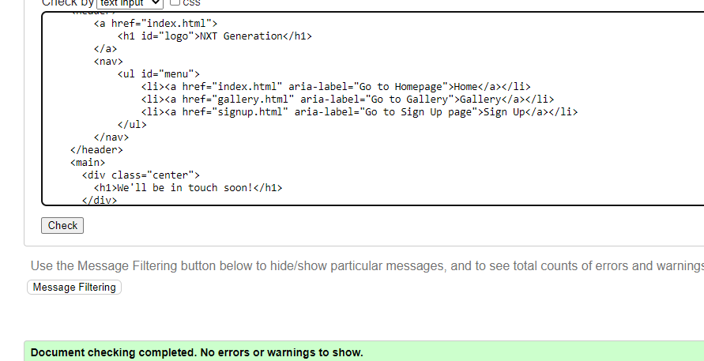

# NXT Generation

NXT Generation is a website for a 2 youth clubs based in London. The site is targeted towards young people who are looking to join a club to partake in a variety of sporting activities and join a community of like minded people.
The site can be accessed by this [link](https://khalidcodes1.github.io/nxt_gen/)

## User stories
### First Time Visitor Goals:
* As a First Time Visitor, I want to easily understand the main purpose of the site, so I can learn more about the organization.
* As a First Time Visitor, I want to be able to easily navigate through the website, so I can find the content.
* As a First Time Visitor, I want to see the locations of the youth club.
### Frequent Visitor Goals:
* As a Frequent User, I want to check whether there are any updates about the youth club.

## Features

+ ### Navbar

+ ##### Navigation
    - Positioned at the top of the page.
    - Contains logo of the company on the left side.
    - Contains navigation links on the right side:
        * HOME - leads to the home page where users can learn about the youth club and it's values.
        * GALLERY - leads to the gallery page where users can see existing members of the club.
        * Sign Up - leads to the sign-up page where users can fill out the form in order to become a member.
    - The links have animated hover effect.
    - The navigation is clear and easy to understand for the user.
    
    

    + ### Home Page

    - Represent: 

        * The main ethos of the club.
        * The locations of the youth club.

    

    + #### Hero Section

    - Hero section has a fixed background image with the club's slogan.

    

    + #### Ethos Section

    - Ethos section contains a short message detailing the core values of the club.

    

    + #### Locations Section

    - Gives the user the locations of the youth club.

    

     + #### Footer

    - Footer contains social media links that open in a new tab.
    

    + ### Gallery Page

    - It has photos of the existing members of the club.

        - The gallery is responsive: the size of the photo depends on the user's screen.

    - It has a footer identical to the home page's footer.

    

    + ### Contact page

    - Contact page has a contact form:

        - All text input fields are customized.
        - Labels are animated when the input field is in focus and are not empty.
        - All inputs are set to be required to fill out.
        - It has 2 checkboxes for the user to choose the location they would prefer.
        - Submit button is animated on hover.
        - Submit button leads to the response page.

         

         + ### Response page

    - Response page appears after submitting the contact form.
    - It contains a short message saying "We'll be in touch soon!" 
    - It will automatically direct the user to the main page in 10 seconds.

     

     
     ## Technologies Used

- [HTML](https://developer.mozilla.org/en-US/docs/Web/HTML) was used as the foundation of the site.
- [CSS](https://developer.mozilla.org/en-US/docs/Web/css) - was used to add the styles and layout of the site.
- [CSS Flexbox](https://developer.mozilla.org/en-US/docs/Learn/CSS/CSS_layout/Flexbox) - was used to arrange items simmetrically on the pages.
- [CSS Grid](https://developer.mozilla.org/en-US/docs/Web/CSS/grid) - was used to make the gallery page.
- [Git](https://git-scm.com/) was used for the version control of the website.
- [GitHub](https://github.com/) was used to host the code of the website.

## Design

### Colour Scheme

- The main colour scheme used in the website is black and white due to their difference in contrast.

- Crimson was also used for the hover effect on the navigation bar and the focus on the form fields as well the join button.

### Typography

- Roboto Google Font was used as the main font of the website in order to increase readability of the content on the pages.

- Archivo Black Google Font was used for the headings on the site.

## Testing

In order to confirm the correct functionality and responsiveness:

+ The website was tested on the following browsers:

    - Chrome

    - FireFox

+ The website was checked by devtools implemented in Firefox and Chrome browsers.

### Manual testing

| feature | action | expected result | tested | passed | comments |
| --- | --- | --- | --- | --- | --- |
| Navbar | | | | | |
| Home | Click on the "Home" link | The user is redirected to the main page | Yes | Yes | - |
| Gallery | Click on the "Gallery" link | The user is redirected to the gallery page | Yes | Yes | - |
| Contact | Click on the "Contact" link | The user is redirected to the contact page | Yes | Yes | - |
| Footer | | | | | |
| Instagram icon in the footer | Click on the Instagram icon | The user is redirected to the Instagram page | Yes | Yes | - |
| Facebook icon in the footer | Click on the Facebook icon | The user is redirected to the Facebook page | Yes | Yes | - |
| Twitter icon in the footer | Click on the Twitter icon | The user is redirected to the Twitter page | Yes | Yes | - |
| YouTube icon in the footer | Click on the YouTube icon | The user is redirected to the YouTube page | Yes | Yes | - |
| Contact page | | | | | |
| First name input | Enter the first name | The first name is entered | Yes | Yes | If user doesn't enter the first name, the error message appears |
| Last name input | Enter the last name | The last name is entered | Yes | Yes | If user doesn't enter the last name, the error message appears |
| Email input | Enter the email | The email is entered | Yes | Yes | If user doesn't enter the email, the error message appears. If user enters not valid email, the error message appears |
|Locations checkbox | Click on the checkbox | The checkbox is checked | Yes | Yes | If user does not check one of the options they will be prompted to choose. |
| "Submit" button | Click on the "Submit" button | The user is redirected to the response page | Yes | Yes | - |
| Response page | | | | | |
| Response message | The user will be automatically redirected to the home page after 10 seconds | The user is redirected to the home page | Yes | Yes | - |

### Bugs
+ ##### Solved bugs
    1. The layout of the homepage would become distorted on smaller devices due to the grid layout I had used.
        *Solutions:* I created a media query that changed the original grid to another grid to accomodate smaller devices

+ ##### Unsolved bugs
    - None.

## Validator testing
+ ### HTML
  #### Home Page
    - No errors or warnings were found when passing through the official W3C validator.

    
    
  #### Gallery Page
    - No errors or warnings were found when passing through the official W3C validator.

    

  #### Sign up page
    - No errors or warnings were found when passing through the official W3C validator.

    

  #### Response Page
    - No errors or warnings were found when passing through the official W3C validator.

    

+ ### CSS
  No errors were found when passing through the official W3C (Jigsaw) validator:
      

## Deployment

- The site was deployed to GitHub pages. The steps to deploy are as follows: 
  - In the [GitHub repository](https://github.com/khalidcodes1/nxt_gen.git), navigate to the Settings tab 
  - From the source section drop-down menu, select the **Main** Branch, then click "Save".
  - The page will be automatically refreshed with a detailed ribbon display to indicate the successful deployment. 

  The live link can be found [here](https://khalidcodes1.github.io/nxt_gen/)

  ## Local Deployment

In order to make a local copy of this project, you can clone it.
In your IDE Terminal, type the following command to clone my repository:

- `git clone https://github.com/khalidcodes1/nxt_gen.git`

## Future improvements
- Increase the performance of the site by compressing images
- improve the quality of the commit messages (I am aware that some of them are not very clear and not meeting the standards and will improve them in the future).

## Credits

+ #### Content

    - The code for the social media links in the footer was taken from the Love Running walkthrough project.

    + #### Media

    - All the images for the website were taken from [Pexels](https://www.pexels.com/).
    - (I should have put the links to each images individually unfortunately I did not save them.)

+ #### Tools

    - [Tiny PNG](https://tinypng.com/) was used to compress JPEG images.

    
   

    
        

    

   

      

  
        
